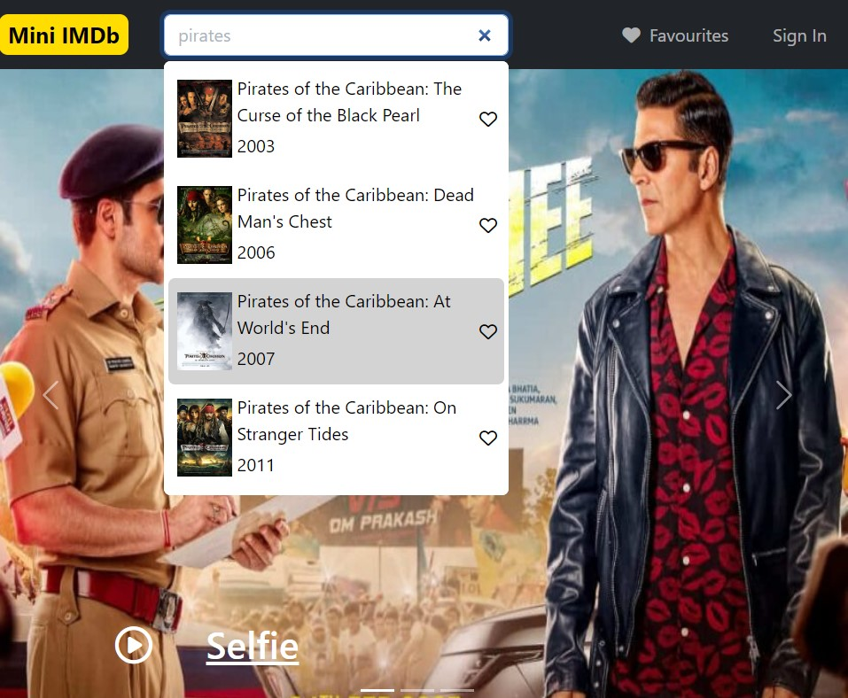
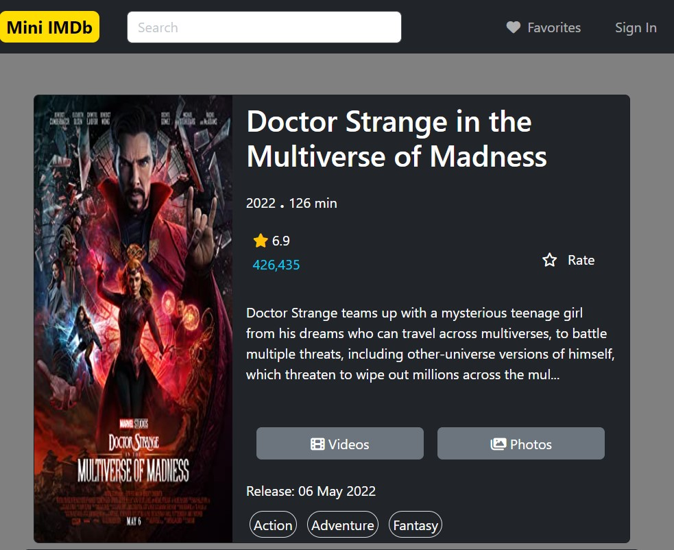
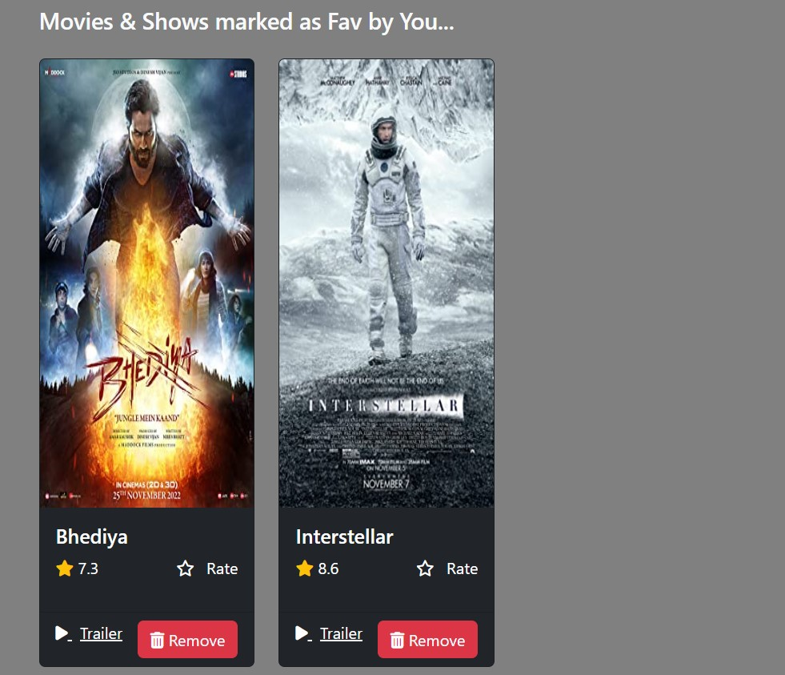

# Mini IMDb

## Overview

    1. Home/Index Page

        Implemented Search movie functionality i.e., it shows movie suggestions as we type in search bar. Also we can see movie details on clicking search result. Movie can be added as a favorite on clicking favorite button on search result.

        > Used Bootstrap Navbar, Carousel, Card components to build index page.

        
        

    2.	Movie Page

        Page opens on click of search result. This page shows all details about a movie i.e., movie plot, name, poster, director, actors, etc.

        

    3.	Favorite movies Page

        Page opens on clicking favorites button on navbar. This page shows movies added as favorite. Also, the list is persistent i.e., does not change after closing, restarting browser. By clicking remove button we can remove that movie from favorites list.

        

## Tools/Libraries/Frameworks used
    * Bootstrap
    Used Bootstrap for styling of components. Used Navbar, Carousel, Card components and various margin, padding, sizing, display utilities.

    * OMDB API
    [OMDB API](https://www.omdbapi.com/)
    OMDB API to get movie details, movie list for search keyword.

    * Font Awesome
    Used Font Awesome for some icons used within page.

    * VS Code
    VS code editor to work on HTML, CSS & JavaScript files.

